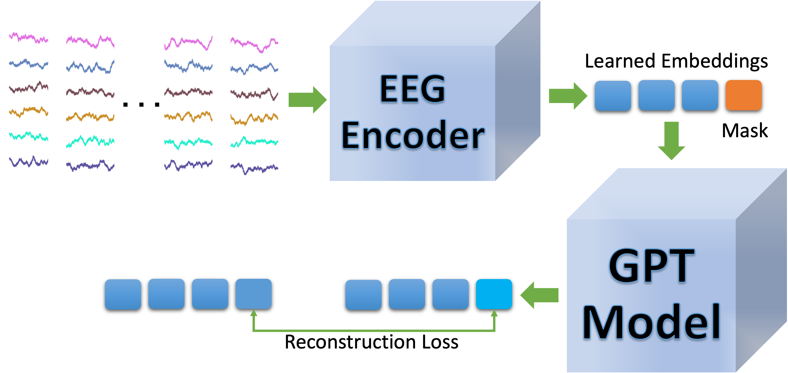

# NeuroGPT
### Neuro-GPT: Towards a Foundation Model for EEG  [link to paper](https://arxiv.org/abs/2311.03764)

#### Published on IEEE - ISBI 2024

We propose Neuro-GPT, a foundation model consisting of an EEG encoder and a GPT model. The foundation model is pre-trained on a large-scale data set using a self-supervised task that learns how to reconstruct masked EEG segments. We then fine-tune the model on a Motor Imagery Classification task to validate its performance in a low-data regime (9 subjects). Our experiments demonstrate that applying a foundation model can significantly improve classification performance compared to a model trained from scratch.
<!-- 
<picture>
<source> -->

<!-- </picture> -->
## Installation
```console
git clone git@github.com:wenhui0206/NeuroGPT.git
cd NeuroGPT/scripts
./train.sh
```

## Requirements
- Python 3.10
- Pytorch 2.2
- Transformers 4.38

## Datasets
- [TUH EEG Corpus](https://isip.piconepress.com/projects/tuh_eeg/html/downloads.shtml#c_tueg)
- [BCI Competition IV 2a Dataset](https://www.bbci.de/competition/iv/#datasets)

## Acknowledgments
This project is developed based on the following open-source repositories:
- [Self-supervised learning of brain dynamics from broad neuroimaging data](https://github.com/athms/learning-from-brains)
- [EEG-Conformer](https://github.com/eeyhsong/EEG-Conformer)
